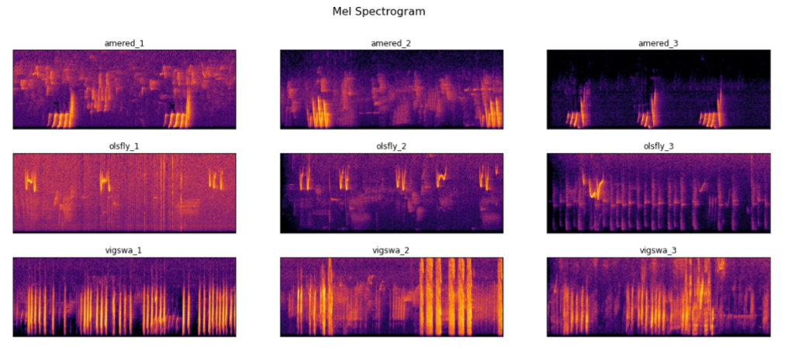

# Cornell Birdcall Identification - Kaggle Competition (top 6% of worldwide entries)

### Abstract

Cornell Birdcall Identification is a kaggle competition. (https://www.kaggle.com/c/birdsong-recognition/overview) Idea of the competition is develop an algorithm to identify bird species from bird vocalization. This repo is to share my attempt on this competition, which was top 6% of worldwide entries.

### The Data

Birdcall audio clips of 264 types of birds were provided by Kaggle. 

### Methodology

Birdcall audio files were cut into 5 second intervals, then select the top 50% of those 5s clips were selected as training data. Audio then transformed to Mel Spectrogram and Gaussian Noise was added to the audio for data augmentation. Birdcall of different bird species have different patterns in Mel Spectrogram, like below.

Image classification model was then built to perform the bird classification task. Choice of model was Efficient Net B3, Global Average Pooling layer was added right after the feature extracted layer and before final fully connected layer. Training was done on P100 GPU in IBM cloud.

### Prediction Strategy

Prediction strategy mainly relied on error analysis on validation data. Original model did not perform very well at beginning, but model performed much better after performing error analysis and deploying new prediction strategy. For the worst 1/3 of bird species predicted by the model, I forced the output to be "nocall". For 1/3 of middle performing bird species, I put a threshold of 80% in order for the model to make a prediction, for 1/3 of confident set of predictions, I put a threshold of 55% for the model to make a prediction. With this prediction strategy, I was able to squeeze quite a bit of performance from my model at testing time and achieved top 6% of worldwide entries.

